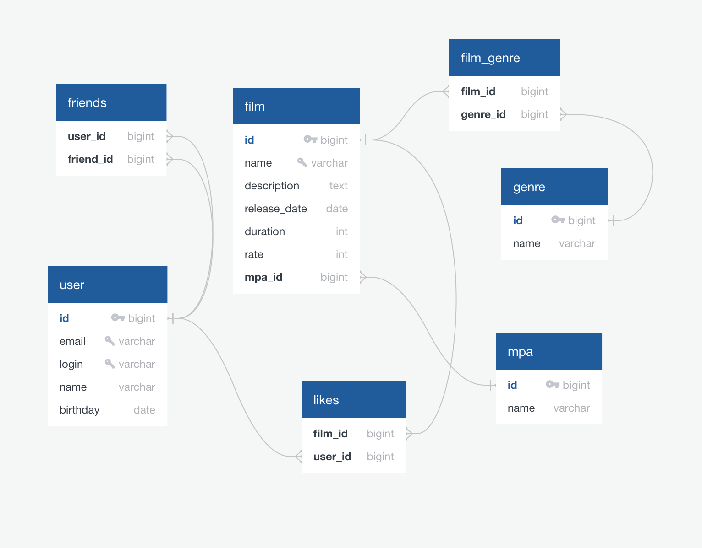

# Filmorate
Бэкенд-сервис, работающий с фильмами и пользовательскими рейтингами.
### Функциональность:
Вы можете добавлять, удалять, обновлять фильмы и пользователей, добавляйте или удаляйте друзей, 
а также вы можете ставить лайки фильмам и получать самые популярные фильмы по лайкам.
## Схема базы данных

### Стек технологий:
Java 11, Spring Framework, H2, Maven, JDBC, Mockito

### Требования к системе:
JDK 11

### Инструкция по запуску:
- Скачать zip-файл
- Распаковать zip-файл
- Открыть приложение в IntellijIdea
- Запуск приложения из основного класса
- Тестовое приложение с коллекцией тестов postman в пакете postman
